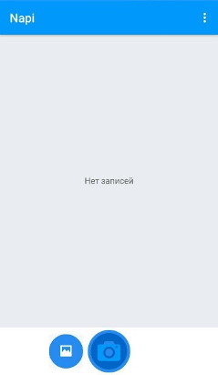
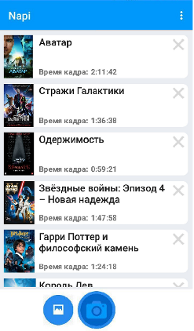
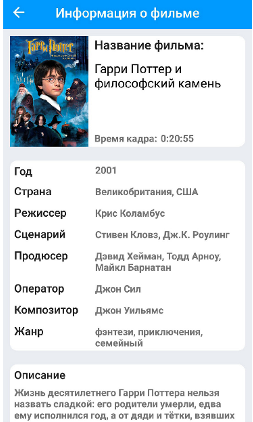
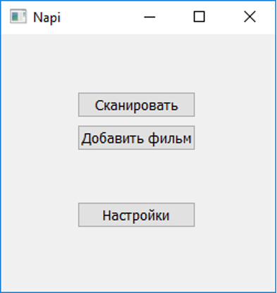
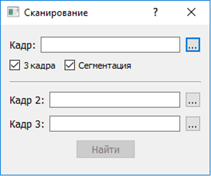
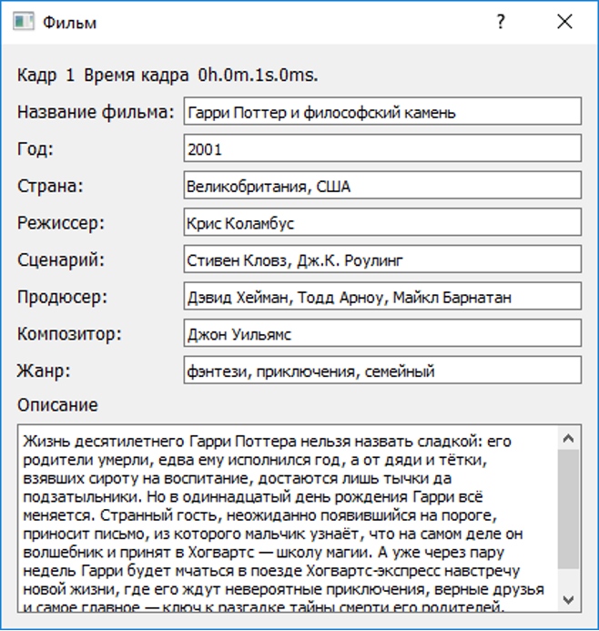
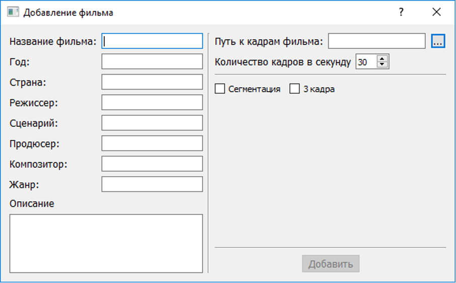
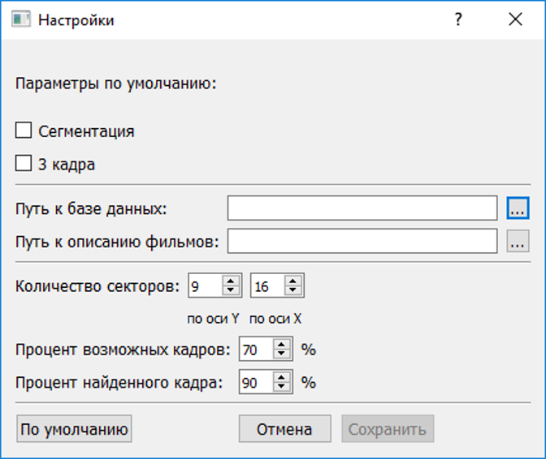

# Областной конкурс «Взлёт» исследовательских проектов
Было создано Android приложение на Java для снятия 3-х секундного фрагмента видео\
и Back-end часть на C++ с помощью фреймворка Qt\
для распознавания отрывка и определения из какого он фильма,\
учитывая погрешность, тряску, блики, мерцания камеры.

## Android приложение

### Демо
https://user-images.githubusercontent.com/49106163/114612870-57b8c680-9cab-11eb-9f35-da4192858daf.mp4

## Программа

